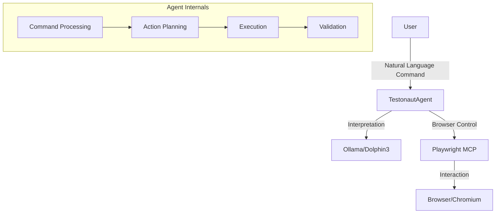
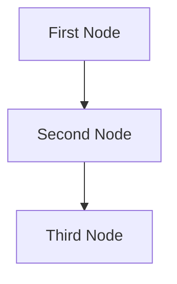

# Design Doc: Testronaut
**Testronaut** is an autonomous testing platform powered by LLMs. It navigates through web applications like a real user - understanding natural language instructions, interacting with interfaces, and validating functionality with precision and context.

> Notes for AI: Keep track of implemented features and pending work.

## Current State - MVP v0.1

> Notes for AI: Document core components and their current implementation status.

### Implemented Components

1. **Browser Automation (Playwright/MCP)**
   - ✅ Local MCP server connection
   - ✅ Basic navigation operations
   - ✅ Browser session management
   - ✅ Page content extraction

2. **LLM Integration (Ollama)**
   - ✅ Model: dolphin3
   - ✅ Basic configuration
   - ⏳ Action interpretation system (in progress)

3. **Core Infrastructure**
   - ✅ Pydantic-based configuration
   - ✅ Loguru logging system
   - ✅ Async operation support

### Current Architecture

> Notes for AI: Update this diagram as new components are added or modified.



### Current Flow

> Notes for AI: Keep flow steps atomic and clearly defined.

1. **Initialization**
   - ✅ MCP connection establishment
   - ✅ Ollama client initialization
   - ✅ Browser page creation

2. **Command Processing**
   - ✅ Natural language input reception
   - ⏳ Ollama interpretation (in progress)
   - ⏳ Action execution (in progress)

3. **Browser Interaction**
   - ✅ URL navigation
   - ✅ Page content extraction
   - ⏳ Element interaction (planned)

## Next Steps

> Notes for AI: Prioritize based on technical dependencies and user value.

### Phase 1 - Core Functionality
1. **Action System**
   - Command interpretation pipeline
   - Action validation
   - Error handling and recovery

2. **Browser Interactions**
   - Click
   - Type
   - Navigate
   - Wait
   - Screenshot
   - Element content extraction

3. **Robustness**
   - Error handling
   - Retry mechanisms
   - Page state validation

### Phase 2 - Advanced Features

> Notes for AI: Consider scalability and maintainability.

1. **Complex Interactions**
   - Form filling
   - Multi-step workflows
   - Dynamic content handling
   - File upload support

2. **Reporting System**
   - Step screenshots
   - Detailed logs
   - Execution metrics
   - Standard format exports

3. **CI/CD Integration**
   - GitHub Actions support
   - Jenkins pipeline integration
   - GitLab CI compatibility

### Phase 3 - Enterprise Features

> Notes for AI: Ensure enterprise-grade security and performance.

1. **Parallel Execution**
   - Concurrent test execution
   - Load distribution
   - Resource management

2. **Security**
   - Credential management
   - Environment isolation
   - Action auditing

3. **Monitoring**
   - Performance metrics
   - Alert system
   - Real-time dashboard

## Implementation Notes

> Notes for AI: Document patterns and decisions for future reference.

### Design Patterns
1. **Agent Pattern**
   - TestonautAgent as central entity
   - External service coordination
   - Autonomous decision making

2. **Configuration Pattern**
   - Centralized Pydantic config
   - Environment variable override
   - Flexible model settings

3. **Async Pattern**
   - Async/await throughout
   - Event-driven architecture
   - Non-blocking operations

### Technical Decisions

> Notes for AI: Track technical choices and rationale.

1. **Technology Stack**
   - Playwright/MCP: Modern, robust browser automation
   - Ollama/Dolphin3: Local, customizable LLM
   - FastMCP: Efficient Python interface
   - PocketFlow: Lightweight flow orchestration

2. **Project Structure**
   - Modular architecture
   - Clear separation of concerns
   - Extensible command system

3. **Development Practices**
   - Async-first design
   - Comprehensive logging
   - Fail-fast error handling

## Requirements

> Notes for AI: Keep it simple and clear.
> If the requirements are abstract, write concrete user stories

## Flow Design

> Notes for AI:
> 1. Consider the design patterns of agent, map-reduce, rag, and workflow. Apply them if they fit.
> 2. Present a concise, high-level description of the workflow.

### Applicable Design Pattern:

1. Map the file summary into chunks, then reduce these chunks into a final summary.
2. Agentic file finder
   - *Context*: The entire summary of the file
   - *Action*: Find the file

### Flow high-level Design:

1. **First Node**: This node is for ...
2. **Second Node**: This node is for ...
3. **Third Node**: This node is for ...



## Utility Functions

> Notes for AI:
> 1. Understand the utility function definition thoroughly by reviewing the doc.
> 2. Include only the necessary utility functions, based on nodes in the flow.

1. **Call LLM** (`utils/call_llm.py`)
   - *Input*: prompt (str)
   - *Output*: response (str)
   - Generally used by most nodes for LLM tasks

2. **Embedding** (`utils/get_embedding.py`)
   - *Input*: str
   - *Output*: a vector of 3072 floats
   - Used by the second node to embed text

## Node Design

### Shared Memory

> Notes for AI: Try to minimize data redundancy

The shared memory structure is organized as follows:

```python
shared = {
    "key": "value"
}
```

### Node Steps

> Notes for AI: Carefully decide whether to use Batch/Async Node/Flow.

1. First Node
  - *Purpose*: Provide a short explanation of the node's function
  - *Type*: Decide between Regular, Batch, or Async
  - *Steps*:
    - *prep*: Read "key" from the shared store
    - *exec*: Call the utility function
    - *post*: Write "key" to the shared store

2. Second Node
  ...


